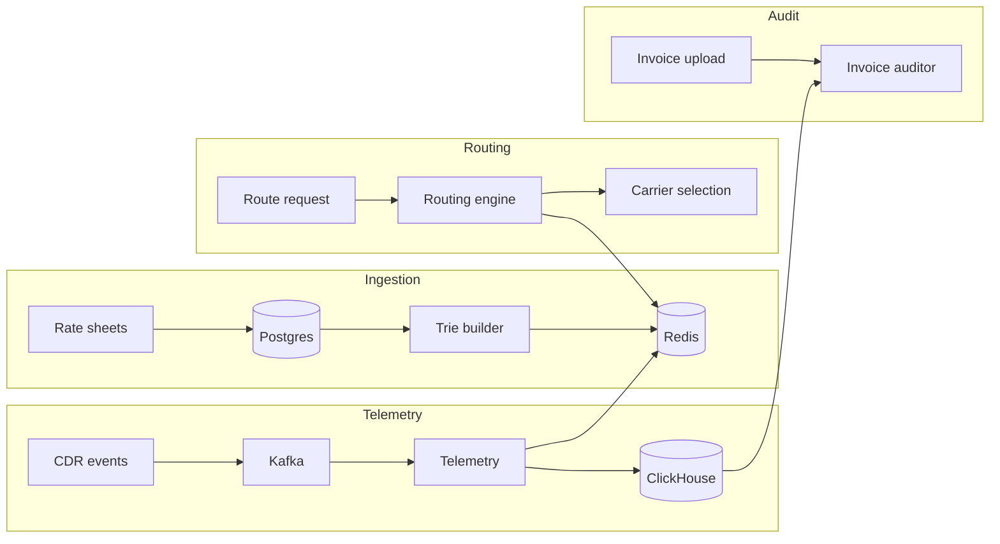

# LCR Platform

A least-cost routing (LCR) system for international voice traffic. Carriers publish rate sheets by destination prefix; the platform picks the cheapest viable route for each call, tracks call detail records (CDRs), monitors carrier quality, and audits invoices against what was actually routed.

Built for local development with Docker Compose and deployable to Minikube.

## What it does

| Area | Description |
|------|-------------|
| **Rate ingestion** | Accepts CSV/JSON rate sheets from multiple vendors, normalizes them, stores them in Postgres, and builds a prefix trie in Redis. |
| **Routing** | Matches a dialed number using longest-prefix match (LPM), ranks carriers by cost (with health penalties), and filters blocklisted carriers. |
| **Telemetry** | Consumes CDR events from Kafka, writes aggregates to ClickHouse, tracks answer-seizure ratio (ASR), and trips blocklists on poor quality. |
| **Invoice audit** | Compares uploaded carrier invoices against ClickHouse CDR totals and flags discrepancies. |
| **Simulation** | Generates test call traffic end-to-end: route lookup → mock carrier → CDR publish. |



## Prerequisites

- **Docker** with a running daemon (Docker Desktop, Colima, etc.)
- **Docker Compose** — either the `docker compose` plugin or standalone `docker-compose`
- **Make**
- **curl** and **python3** (used by Makefile helpers)

Optional, for development outside Docker:

- Go 1.22+
- Java 17 + Maven (routing engine)
- Node.js 18+ (dashboard dev server)

Check that everything is available:

```bash
make check-deps
```

## Quick start

```bash
git clone <repo-url>
cd CommunicationProject

make up            # start infrastructure + services, wait for health, seed rates
make route         # test routing for a UK mobile number
make simulate      # run 1000 simulated calls
make dashboard-up  # open http://localhost:3000
```

`make up` does three things:

1. Starts Postgres, Redis, Kafka, ClickHouse, and all application services via Docker Compose.
2. Waits until ingestion and routing respond on `/health`.
3. Uploads sample rate sheets and rebuilds the Redis trie.

To tear everything down (including volumes):

```bash
make down
```

## Services

| Service | Port | Role |
|---------|------|------|
| Ingestion | 8080 | Rate upload, trie rebuild, blocklist admin |
| Routing engine | 8081 | LCR route decisions |
| Telemetry | 8082 | CDR processing, stats API |
| Mock carrier | 8083 | Simulated carrier endpoint |
| Dashboard | 3000 | Web UI (nginx in Docker, Vite in dev) |
| Postgres | 5432 | Rates, carriers, invoices |
| Redis | 6379 | Prefix trie, blocklist, health scores |
| Kafka | 9092 | `rates.activated`, `cdr.events` |
| ClickHouse | 8123 / 9000 | CDR storage |

Health checks:

```bash
curl http://localhost:8080/health   # ingestion
curl http://localhost:8081/health   # routing
curl http://localhost:8082/health   # telemetry
curl http://localhost:8083/health   # mock carrier
```

## Carriers

Sample data uses three carriers:

| ID | Name |
|----|------|
| `nexatel` | Nexatel International |
| `clearpath` | Clearpath Wholesale |
| `zenith` | Zenith Transit |

The mock carrier container runs as `nexatel` by default (`CARRIER_ID` env var).

## Common tasks

### Route lookup

```bash
make route

# or manually:
curl -s -X POST http://localhost:8081/route \
  -H 'Content-Type: application/json' \
  -d '{"dialedNumber":"44207123456","defaultRegion":"GB"}' | python3 -m json.tool
```

With the LPM demo rates loaded, `44207123456` matches prefix `442` and routes to Clearpath at $0.01/min.

### Upload rate sheets

Authenticated endpoints require header `X-API-Key: local-upload-key`.

```bash
# CSV (default vendor adapter)
curl -X POST "http://localhost:8080/rates/upload?vendor=vendor-default" \
  -H "X-API-Key: local-upload-key" \
  -H "Content-Type: text/csv" \
  --data-binary @scripts/seed/rates-default.csv

# Rebuild Redis trie after upload
curl -X POST http://localhost:8080/admin/trie/rebuild \
  -H "X-API-Key: local-upload-key"
```

Re-run all seed files:

```bash
make seed
```

Seed data lives in `scripts/seed/`:

| File | Format | Vendor adapter |
|------|--------|----------------|
| `rates-default.csv` | CSV | default |
| `rates-vendor-a.csv` | CSV | vendor_a |
| `rates-vendor-b.json` | JSON | vendor_b |
| `rates-lpm-demo.csv` | CSV | default (LPM textbook example) |

### Simulate traffic

```bash
make simulate
```

Sends 1000 calls through routing → mock carrier → Kafka → telemetry. Check results in the dashboard or:

```bash
curl -s http://localhost:8082/api/stats | python3 -m json.tool
curl -s http://localhost:8082/api/activity | python3 -m json.tool
```

### Run invoice auditor

```bash
make audit
```

### Dashboard

Production build in Docker:

```bash
make dashboard-up    # http://localhost:3000
```

Local dev with hot reload:

```bash
make dashboard       # Vite on http://localhost:5173
```

The dashboard shows CDR activity, carrier ASR/blocklist status, route lookup, and service health.

### Clear a blocklisted carrier

```bash
curl -X DELETE http://localhost:8080/admin/blocklist/nexatel \
  -H "X-API-Key: local-upload-key"
```

## Makefile reference

| Target | Description |
|--------|-------------|
| `make check-deps` | Verify Docker and Compose are available |
| `make build` | Build all Docker images |
| `make up` | Start stack, wait for health, seed rates |
| `make down` | Stop stack and remove volumes |
| `make seed` | Upload sample rate sheets and rebuild trie |
| `make route` | Test routing for `447700900123` |
| `make simulate` | Run traffic simulator (1000 calls) |
| `make audit` | Run invoice auditor job |
| `make dashboard` | Start dashboard dev server |
| `make dashboard-up` | Build and run dashboard container |
| `make test` | Run Go and Java unit tests |
| `make minikube` | Start Minikube cluster |
| `make deploy` | Build images and apply K8s manifests |

Override defaults as needed:

```bash
API_KEY=my-key make seed
INGESTION_URL=http://ingestion.local:8080 make seed
```

## Project layout

```
services/
  ingestion/          Go — rate upload API, trie builder, scheduler
  routing-engine/     Java/Spring WebFlux — LPM routing from Redis
  telemetry/          Go — Kafka consumers, ClickHouse writer, stats API
  mock-carrier/       Go — test carrier that emits CDRs
  traffic-simulator/  Go — batch call generator
  invoice-auditor/    Python/Polars — invoice reconciliation
dashboard/            React + Vite UI
infra/
  k8s/                Kustomize manifests for Minikube
  clickhouse/         Schema init
scripts/
  seed/               Sample rate sheets and upload script
  chaos/              Failure injection scripts
contracts/schemas/    JSON schemas for rate sheets, CDRs, route responses
```

## Minikube deployment

Requires Minikube with at least 8 GB RAM allocated.

```bash
make minikube    # starts profile "carrier-opt" (8 GB / 4 CPU)
make deploy      # build images into Minikube and apply manifests
make seed        # upload rates to the ingestion service
```

K8s resources are under `infra/k8s/`, namespaced as `carrier-opt`. See [docs/architecture.md](docs/architecture.md) for Redis key layout, Kafka topics, and memory limits.

## Development

Run unit tests:

```bash
make test
# or individually:
make test-go
make test-java
```

The compose wrapper at `scripts/compose.sh` supports both `docker compose` and `docker-compose`, and works around a missing `docker-credential-desktop` helper on Colima setups. If image pulls fail with credential errors, remove `"credsStore"` from `~/.docker/config.json`.

## Troubleshooting

**`make up` fails during seed** — ingestion may not be ready yet. Wait a few seconds and run `make seed` again.

**401 on rate upload** — the running ingestion container may have a stale `API_KEY`. Rebuild: `./scripts/compose.sh up -d --build ingestion`.

**Routing returns empty candidates** — trie may not be built. Run `make seed` or trigger a manual trie rebuild (see above).

**Dashboard shows no CDRs** — run `make simulate` first, then refresh the dashboard.

**Port conflicts** — check nothing else is bound to 3000, 5432, 6379, 8080–8083, 9092.
